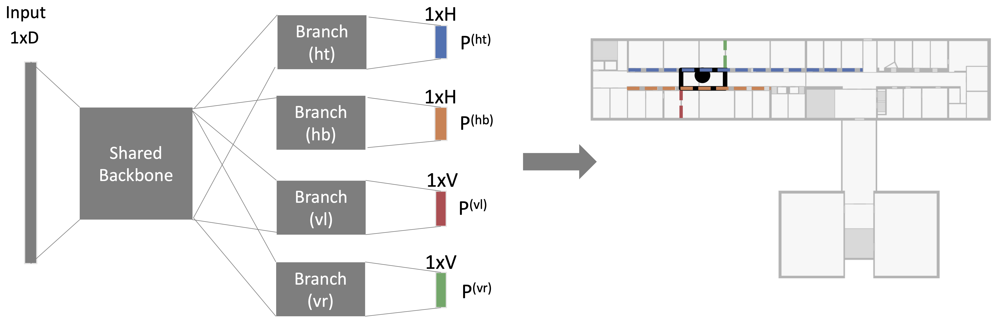
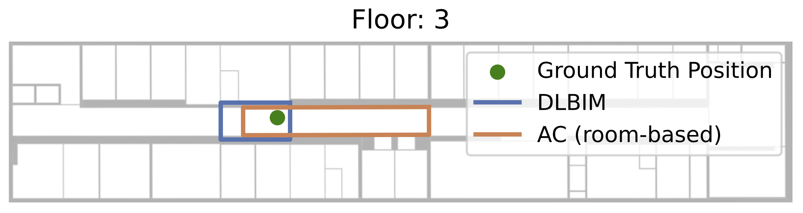

## DeepLocBIM: Learning Indoor Area Localization Guided by Digital Building Models

This repository holds the official implementation of DeepLocBIM, a neural network model for indoor *area* localization 
that incorporates the building model within the learning phase, which was proposed in:

> M. Laska and J. Blankenbach, "DeepLocBIM: Learning Indoor Area Localization Guided by Digital Building Models," in IEEE Internet of Things Journal, doi: [10.1109/JIOT.2022.3149549](https://ieeexplore.ieee.org/document/9706319).

> Fingerprinting based indoor localization is a cost-effective approach to provide coarse-grained indoor location information for pedestrian mass-market applications without the requirement of installing additional positioning infrastructure. While most solutions aim at pinpointing the exact location of a user, estimating a zone/area is a promising approach to achieve a more reliable prediction. Area localization predominantly utilizes a pre-determined building model segmentation to obtain zone/area labels for collected fingerprints. We propose a novel approach to multi-floor indoor area localization by directly predicting polygon-zones that contain the position of the user. Our model learns to construct the zones from the wall segments and thus predicted areas have a high conformity to the underlying building model (semantic expressiveness). On a self-collected as well as on a public fingerprinting dataset, we compare our model with two reference approaches. We demonstrate that the utilized surface areas of the polygons is on average up-to 50% smaller than those of the reference models and provides a high semantic expressiveness without requiring manual floor plan segmentation.



It is demonstrated how to apply it on the **giaIndoorLoc** dataset as described in the paper [VI-SLAM2tag](https://doi.org/10.48550/arXiv.2207.02668), in which the dataset was introduced together with its generation procedure.

### Installation

Clone the repository and install the required packages as listed in the ```requirements.txt``` file.
Installation via any virtual environment such as *virtualenv* or *conda* are is strongly recommended. 

### Dataset integration

For training the network on the [giaIndoorLoc](https://doi.org/10.5281/zenodo.6801310) dataset, it has to be downloaded and placed in the ```datasets``` folder.

### Train and evaluate network

To train the DLBIM model, a ```config.yml``` file has to be set up. An example file can be found in the ```config``` folder. Any parameter not specified in the ```config.yml```
will be taken from the default values given in ```config/default_params.py```.
Afterwards the pipelines specified within the config file can be executed via
```shell
python pipeline.py -c path/to/config.yml
```

### Reference model
For comparison reasons we implemented a room-based classification neural network. It will also be trained
when executing the preconfigured pipeline.

### Visualization of predictions
The predictions of the models can be visualized and displayed along with the ground truth position for each fingerprint of the test partition of the dataset.
Just add the flag ```--visualize_predictions``` when executing a pipeline as
```shell
python pipeline.py -c path/to/config.yml --visualize_predictions
```
For each prediction a plotting window such as  

will open. Once the window is closed, the predictions for the next fingerprint of the test dataset will be shown and so on.

### Code overview of DLBIM implementation

The main code related to the implementation of DLBIM can be found in the source files as listed below:
- ```dlbim_data_provider.py``` contains target vector construction (section IV-C) and decoding of model prediction to obtain polygon and floor prediction
- ```dlbim_model.py``` contains the model definition and loss function of the model
- ```model_definition.py``` contains the tensorflow model base architecture (section IV-B), which is customizable via supplying different config files.

### Model and dataset extension
The repository has been designed to also provide easy integration with other datasets and models.
You have to provide the following:
- Dataset connector: which extracts the data and stores it in the specified format of the repository (please see source file documentation for details)
- Data provider: transforms the raw data of a dataset connector to the format required by the model
- Model: has to implement setup and evaluation function and might overwrite the fit function.

Please study the documented source code for details.
